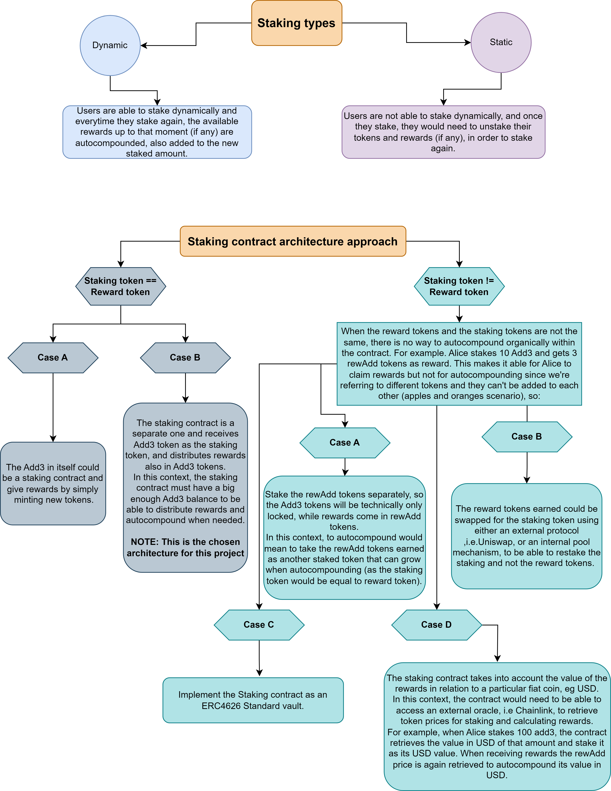
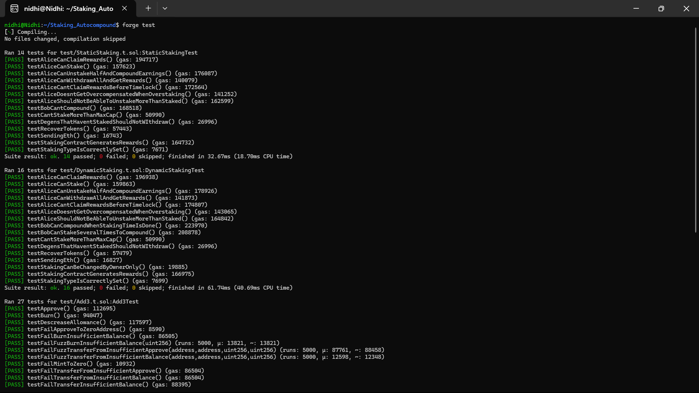

### WARNING: This code is not intended to be used in production/mainnets and it's not recommended to deposit real funds in it. Use at own risk.

## About

This codebase uses the Foundry framework due to the overall benefits and speed of it as well as the requisites of the task. This project consists of an two main smart contracts:

1. An ERC20 Token (Add3) that is Burnable, Mintable and Pausable. It allows only the owner to:

- Mint an input amount of tokens to an arbitrary wallet.

- Burn an input amount of only ERC20 Smart Contract owner’s tokens.

- Pause the contract (by default the contract is not paused)

2. A UUPS upgradeable staking contract hat once initialized, can be set to be Dynamic or Static, allowing to perform or not autocompound.

The architectural design chosen is to have a single ERC20 contract created (Add3) that will be used as staking token and as reward token in the staking contract, for simplicity reasons and to align with the test scenarios. In the following diagram you can find more detailed as per why the decision:



The staking smart contract is particularly tested with the following values:

```
REWARD_RATE = 10;
STAKING_DURATION = 365 days;
MINIMUM_LOCK_TIME = 60 days;
MAX_TOTAL_SUPPLY = type(uint128).max  => Equivalent to 340282366920938463463374607431768211455;
```

This would represent an return of 10% over a period of 1 year (365 days) with a minimum lock time of 60 days, with availability for autocompounding when re-staking tokens.

## Testing

#### **As a pre-requisite, you must have Foundry installed: https://book.getfoundry.sh/getting-started/installation**

To clone this repository and run the tests in a single line, run the following command:

**_In Windows Powershell_**

```copy
git clone https://github.com/nidhinakranii/Staking-Autocompound.git ; cd ./autocompound_staking ; forge test
```

**_In Linux/Mac terminal_**

```copy
git clone https://github.com/nidhinakranii/Staking-Autocompound.git && cd autocompound_staking && forge test
```

Or,

if the repository is already cloned, just run the following command:

```copy
forge test --vvv
```

This should run the following 57 tests:



### Deployment

**NOTE: The test suite for this project is a work in progress and does not fully test all functionality yet. There are basic fuzzing tests for the Add3 token but a more extensive fuzzing and invariant testing of the staking contract can be made to better cover the codebase.**
